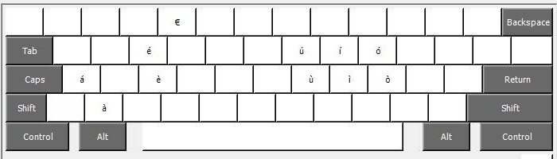

# IT-ProgrammingLayout

This repository contains a custom layout made for italian programmers

The layout is based on the US one, so it has easy access to keys like: `\` and `~`, but it has some custom key bindings for the italian accented letters... In particular:

 - `á` is done with `altgr + a`
 - `é` is done with `altgr + e`
 - `í` is done with `altgr + i`
 - `ó` is done with `altgr + o`
 - `ú` is done with `altgr + u`
 - `Á` is done with `altgr + shift + a`
 - `É` is done with `altgr + shift + e`
 - `Í` is done with `altgr + shift + i`
 - `Ó` is done with `altgr + shift + o`
 - `Ú` is done with `altgr + shift + u`
 - `à` is done with `altgr + z`
 - `è` is done with `altgr + d`
 - `ì` is done with `altgr + k`
 - `ò` is done with `altgr + l`
 - `ù` is done with `altgr + i`
 - `À` is done with `altgr + shift + z`
 - `È` is done with `altgr + shift + d`
 - `Ì` is done with `altgr + shift + k`
 - `Ò` is done with `altgr + shift + l`
 - `Ù` is done with `altgr + shift + i`
 - `€` is done with `altgr + 4`

 the second part of the layout may seems a little random at first, until you realize that is just one letter below in the qwerty layout, so for example `z` is below `a`

## How to install

To install the layout on windows you need to run the `setup.exe` file inside `windows/build`, and then add the layout form windows's setups

## How to build it your self

If you want to customize the layout you can do it by editing the file `IT-prog layout.klc` inside `windows` using [Microsoft Layout Creator](https://www.microsoft.com/en-us/download/details.aspx?id=102134) 

## Potential issues

The only issue you may encounter with this layout is in tha case some programs map some shortcuts to Alt + one of the key used. for example by default the Nvidia Geforce Experience map the overlay to `Alt + z`, in this case, your only option is to remap the key if you want to continue using this layout 